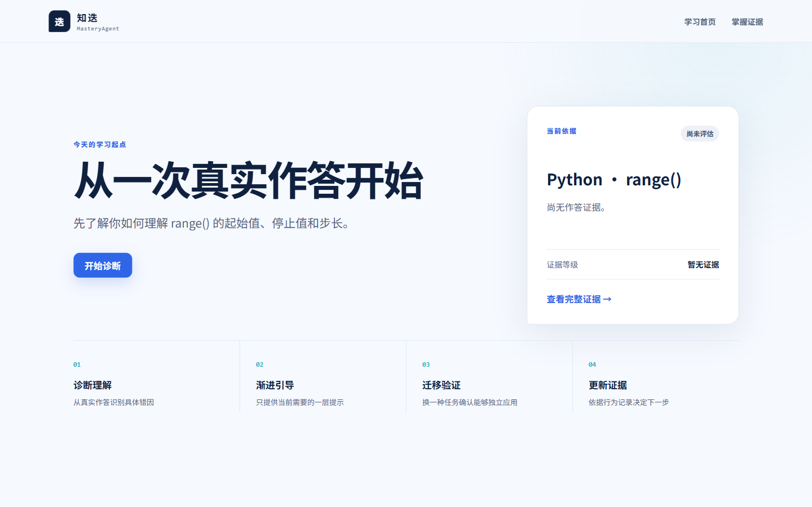
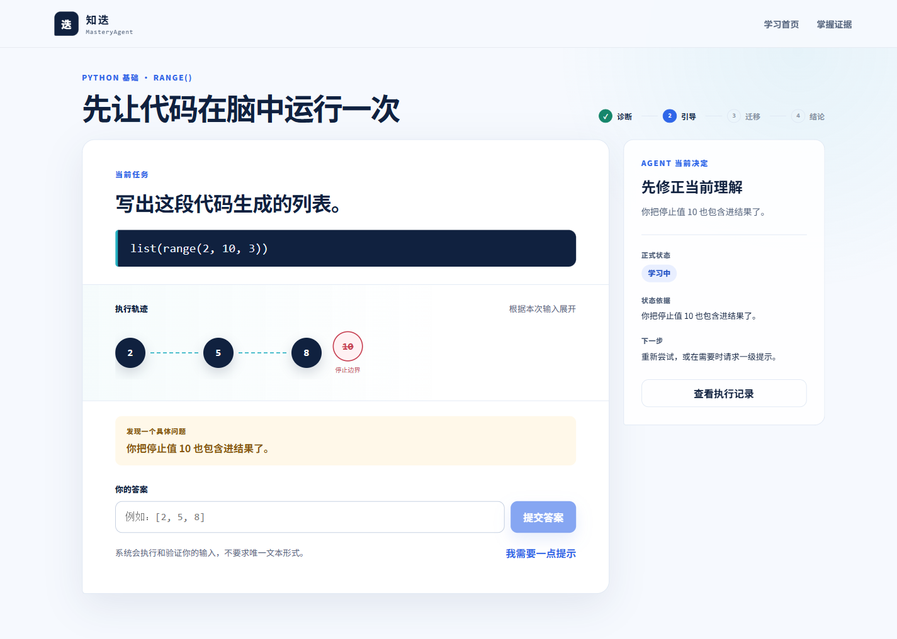
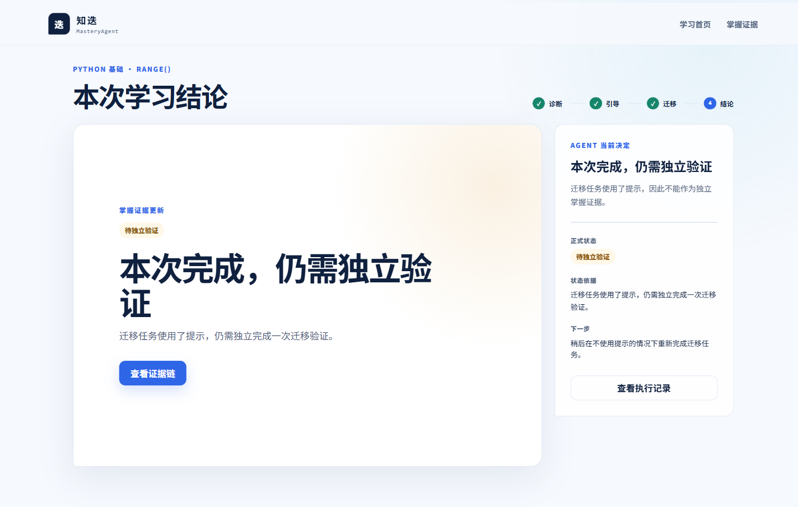
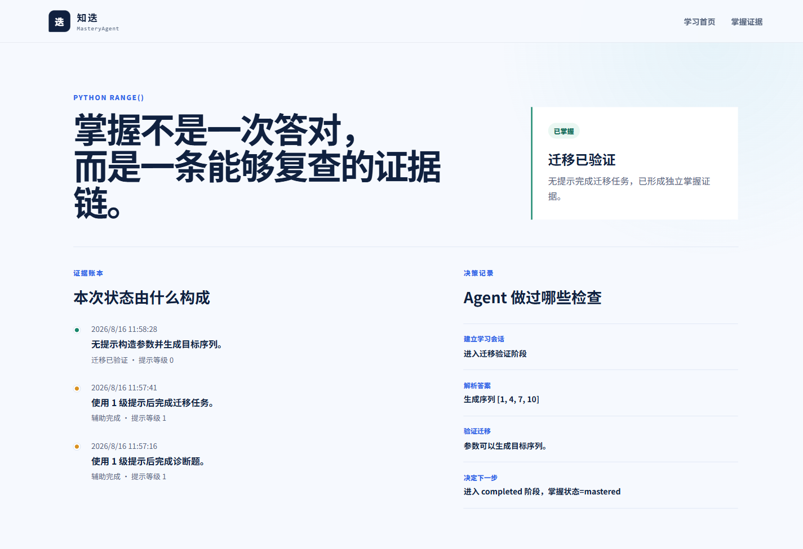

# 知迭 v0.1 使用指南

知迭通过真实作答识别理解差异，使用渐进提示提供必要帮助，再通过迁移任务判断学习者能否独立应用知识。v0.1 聚焦 Python `range()`，默认在本地离线运行。

## 1. 启动知迭

### 环境要求

- Windows PowerShell；
- Python 3.11 或更高版本；
- Node.js 20 或更高版本；
- pnpm。

如果尚未安装 pnpm，可以执行：

```powershell
npm install -g pnpm
```

在仓库根目录运行：

```powershell
powershell -ExecutionPolicy Bypass -File .\scripts\start.ps1
```

脚本会准备本地依赖并启动：

- 学习界面：<http://127.0.0.1:5173>
- API 文档：<http://127.0.0.1:8000/docs>

看到 `Zhidie is running` 后，在浏览器打开学习界面。使用结束后，回到启动脚本窗口按回车，前后端服务会一起停止。

## 2. 从首页开始

首页展示当前建议、掌握状态和下一步动作。第一次进入时，点击“开始诊断”建立本地学习会话。



页面下方展示完整学习路径：诊断理解、渐进引导、迁移验证和更新证据。系统会根据已有会话自动切换“开始诊断”“继续学习”或“开始迁移验证”。

## 3. 完成诊断题

学习工作台分成两个区域：

- 左侧是当前任务、执行轨迹、诊断反馈和答案输入；
- 右侧是 Agent 当前决定、状态依据和下一步动作。

答案可以使用 Python 列表形式，例如：

```text
[2, 5, 8]
```

不同错误会产生不同诊断。例如输入 `[2, 5, 8, 10]` 时，系统会指出停止值不应包含在结果中，并在执行轨迹上标出停止边界。



如果暂时无法修正，可以点击“我需要一点提示”。提示最多分为三级，只增加当前需要的信息，不直接替代学习者完成作答。

## 4. 理解提示对掌握状态的影响

一次答对不一定代表已经掌握。知迭会区分：

| 状态 | 含义 |
|---|---|
| 当前答对 | 本次答案正确，但证据可能仍然不足 |
| 辅助完成 | 使用提示后完成，只记录辅助证据 |
| 待独立验证 | 还需要一次不使用提示的迁移成功 |
| 已掌握 | 无提示完成迁移任务，形成正式掌握证据 |

如果迁移任务使用了提示，即使答案正确，本次结论仍是“待独立验证”。



回到学习首页后，系统会提供“开始迁移验证”入口。新会话不会携带上一次任务的提示记录。

## 5. 完成独立迁移验证

迁移任务要求根据目标序列构造 `range()` 参数。可以输入：

```text
range(1, 11, 3)
```

也可以输入等价的三元组：

```text
(1, 11, 3)
```

系统根据参数实际生成的序列判断结果，不要求唯一文本写法。只有在当前迁移任务中没有请求提示且实际序列正确，正式状态才会更新为“已掌握”。

## 6. 查看掌握证据和 Agent Trace

点击“查看证据链”或顶部“掌握证据”，可以查看：

- 当前掌握状态及原因；
- 每条证据对应的任务和时间；
- 是否使用提示及提示等级；
- 独立作答、辅助完成和迁移验证记录；
- Agent 执行过的解析、诊断、验证和决策动作。



Agent Trace 只展示安全摘要，不包含系统提示词、模型思维链、密钥、异常堆栈或个人隐私。

## 7. 常见问题

### 页面提示无法连接学习服务

确认启动脚本窗口仍在运行，并访问 <http://127.0.0.1:8000/api/v1/health>。正常响应应包含：

```json
{
  "status": "ok",
  "mode": "offline-deterministic"
}
```

### 提交按钮不可用

答案输入框为空时，提交按钮会保持禁用。输入内容后即可提交。

### 答案格式无法解析

诊断题使用整数列表，例如 `[2, 5, 8]`；迁移题使用 `range(start, stop, step)` 或三个整数构成的列表、元组。

### 页面提示会话已经更新

同一会话可能已在其他页面发生变化。刷新当前页面，系统会读取最新会话版本。

### 端口已被占用

确认本机的 `5173` 和 `8000` 端口没有被其他程序使用，停止占用端口的程序后重新运行启动脚本。

## 8. 本地数据与重置

学习记录保存在：

```text
backend/data/mastery.db
```

该数据库只保存在本机，不会提交到 Git。需要重新体验初始流程时，请先停止服务，再将 `mastery.db` 重命名为备份文件；下次启动会自动建立新的空数据库。确认不再需要旧记录后再删除备份。

## 9. v0.1 范围

v0.1 提供 Python `range()` 的完整掌握学习闭环，使用本地体验身份和确定性离线规则。它不包含账户登录、多用户隔离、教师端、文件上传、RAG、在线模型服务或真实代码沙箱。

更多信息：

- [产品需求](PRODUCT_REQUIREMENTS.md)
- [前端设计](FRONTEND_DESIGN.md)
- [API 契约](API_CONTRACT.md)
- [贡献规范](../CONTRIBUTING.md)
